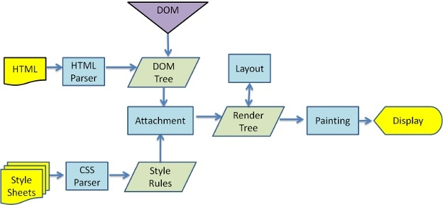

#### 序列化

序列化的作用是存储和传输：
	存储(对象本身存储的只是一个地址映射，如果断电，对象将不复存在，因此需将对象的内容转换成字符串的形式再保存在磁盘上)
	传输（例如 如果请求的Content-Type是 application/x-www-form-urlencoded，则前端这边需要使用qs.stringify(data)来序列化参数再传给后端，否则后端接受不到；ps:  Content-Type 为 application/json;charset=UTF-8或者 multipart/form-data 则可以不需要）

#### Event loop

[JavaScript 执行机制]: https://juejin.im/post/59e85eebf265da430d571f89

微任务包括 `process.nextTick` ，`promise` ，`MutationObserver`

宏任务包括 `script` ， `setTimeout` ，`setInterval` ，`setImmediate` ，`I/O` ，`UI rendering`

事件循环的顺序，决定js代码的执行顺序。进入整体代码(宏任务)后，开始第一次循环。接着执行所有的微任务。然后再次从宏任务开始，找到其中一个任务队列执行完毕，再执行所有的微任务。

```js
setTimeout(function() {
    console.log('setTimeout');
})

new Promise(function(resolve) {
    console.log('promise');
}).then(function() {
    console.log('then');
})

console.log('console');
```

这段代码作为宏任务，进入主线程。
先遇到`setTimeout`，那么将其回调函数注册后分发到宏任务Event Queue。
接下来遇到了`Promise`，`new Promise`立即执行，`then`函数分发到微任务Event Queue。
遇到`console.log()`，立即执行。
好啦，整体代码script作为第一个宏任务执行结束，看看有哪些微任务？我们发现了`then`在微任务Event Queue里面，执行。
ok，第一轮事件循环结束了，我们开始第二轮循环，当然要从宏任务Event Queue开始。我们发现了宏任务Event Queue中`setTimeout`对应的回调函数，立即执行。
结束。

#### JavaScript 中的执行上下文和执行栈（执行栈存储执行上下文）

 执行上下文是当前 JavaScript 代码被解析和执行时所在环境的抽象概念。 

#### 执行上下文的类型

执行上下文总共有三种类型

- **全局执行上下文**：只有一个，浏览器中的全局对象就是 window 对象，`this` 指向这个全局对象。
- **函数执行上下文**：存在无数个，只有在函数被调用的时候才会被创建，每次调用函数都会创建一个新的执行上下文。
- **Eval 函数执行上下文**： 指的是运行在 `eval` 函数中的代码，很少用而且不建议使用。

#### 执行栈

执行栈，也叫调用栈，具有 LIFO（后进先出）结构，用于存储在代码执行期间创建的所有执行上下文。
首次运行JS代码时，会创建一个**全局**执行上下文并Push到当前的执行栈中。每当发生函数调用，引擎都会为该函数创建一个**新的函数**执行上下文并Push到当前执行栈的栈顶。根据执行栈LIFO规则，当栈顶函数运行完成后，其对应的**函数**执行上下文将会从执行栈中Pop出，上下文控制权将移到当前执行栈的**下一个**执行上下文。

#### javascript的执行和运行

执行和运行有很大的区别，javascript在不同的环境下，比如node，浏览器，Ringo等等，执行方式是不同的。而运行大多指javascript解析引擎，是统一的。

#### 浏览器是如何呈现一张页面的

过程：

- 解析HTML，并生成一棵DOM tree
- 解析各种样式并结合DOM tree生成一棵Render tree
- 对Render tree的各个节点计算布局信息，比如box的位置与尺寸
- 根据Render tree并利用浏览器的UI层进行绘制

  　 DOM对象本身是一个js对象 ，DOM tree和Render tree上的节点并非一一对应，比如一个"`display:none"`的节点就只会存在于DOM tree上，而不会出现在Render tree上，因为这个节点不需要被绘制。 

Webkit和Gecko 基本流程




尽管webkit和Gecko使用的术语稍有不同，他们的主要流程基本相同。Gecko称可见的格式化元素组成的树为frame树，每个元素都是一个frame，webkit则使用render树这个名词来命名由渲染对象组成的树。Webkit中元素的定位称为布局，而Gecko中称为回流。Webkit称利用dom节点及样式信息去构建render树的过程为attachment，Gecko在html和dom树之间附加了一层，这层称为内容接收器，相当制造dom元素的工厂。下面将讨论流程中的各个阶段。 

渲染引擎开始解析html，并将标签转化为内容树中的dom节点。接着，它解析外部CSS文件及style标签中的样式信息。这些样式信息以及html中的可见性指令将被用来构建另一棵树——render树。Render树由一些包含有颜色和大小等属性的矩形组成，它们将被按照正确的顺序显示到屏幕上。Render树构建好了之后，将会执行布局过程，它将确定每个节点在屏幕上的确切坐标。再下一步就是绘制，即遍历render树，并使用UI后端层绘制每个节点。
值得注意的是，这个过程是逐步完成的，为了更好的用户体验，渲染引擎将会尽可能早的将内容呈现到屏幕上，并不会等到所有的html都解析完成之后再去构建和布局render树。它是解析完一部分内容就显示一部分内容，同时，可能还在通过网络下载其余内容。

如下的操作会触发浏览器执行layout：

- 通过js获取需要计算的DOM属性
- 添加或删除DOM元素
- resize浏览器窗口大小
- 改变字体
- css伪类的激活，比如:hover
- 通过js修改DOM元素样式且该样式涉及到尺寸的改变

