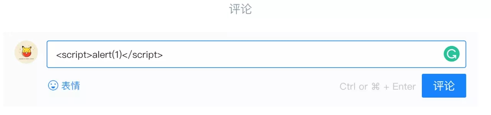
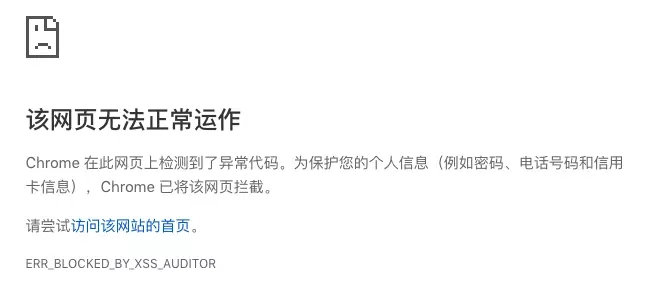

[安全防范知识点]: https://juejin.im/book/5bdc715fe51d454e755f75ef/section/5bdc721851882516c33430a2


#### XSS   跨站脚本漏洞

就是攻击者想尽一切办法将可以执行的代码注入到网页中。总体上分为两类：**持久型和非持久型**。
持久型也就是攻击的代码被服务端写入进**数据库**中，这种攻击危害性很大，因为如果网站访问量很大的话，就会导致大量正常访问页面的用户都受到攻击。
举个例子，对于评论功能来说，就得防范持久型 XSS 攻击，因为我可以在评论中输入以下内容，这种情况如果前后端没有做好防御的话，这段评论就会被存储到数据库中，这样每个打开该页面的用户都会被攻击到。


非持久型相比于前者危害就小的多了，一般通过**修改 URL 参数**的方式加入攻击代码，诱导用户访问链接从而进行攻击。举个例子，如果页面需要从 URL 中获取某些参数作为内容的话，不经过过滤就会导致攻击代码被执行

```vue
<!-- http://www.domain.com?name=<script>alert(1)</script> -->
<div>{{name}}</div>     
```

但是对于这种攻击方式来说，如果用户使用 Chrome 这类浏览器的话，浏览器就能自动帮助用户防御攻击。但是我们不能因此就不防御此类攻击了，因为不能确保用户都使用了该类浏览器。 



 对于 XSS 攻击来说，通常有两种方式可以用来防御。 

 1.转义输入输出的内容，对于引号、尖括号、斜杠进行转义 

```js
function escape(str) {
  str = str.replace(/&/g, '&amp;')
  str = str.replace(/</g, '&lt;')
  str = str.replace(/>/g, '&gt;')
  str = str.replace(/"/g, '&quto;')
  str = str.replace(/'/g, '&#39;')
  str = str.replace(/`/g, '&#96;')
  str = str.replace(/\//g, '&#x2F;')
  return str
} 
//通过转义可以将攻击代码 `alert(1)` 变成 
// -> &lt;script&gt;alert(1)&lt;&#x2F;script&gt;
escape('<script>alert(1)</script>')
```

2.但是对于显示富文本来说，显然不能通过上面的办法来转义所有字符，因为这样会把需要的格式也过滤掉。对于这种情况，通常采用白名单过滤的办法，当然也可以通过黑名单过滤，但是考虑到需要过滤的标签和标签属性实在太多，更加推荐使用白名单的方式。 

```js
//示例使用了js-xss来实现，可以看到在输出中保留了h1标签且过滤了script标签。 
const xss = require('xss')
let html = xss('<h1 id="title">XSS Demo</h1><script>alert("xss");</script>')
// -> <h1>XSS Demo</h1>&lt;script&gt;alert("xss");&lt;/script&gt;
console.log(html)
```

#### CSP

CSP 本质上就是建立白名单，开发者明确告诉浏览器哪些外部资源可以加载和执行。我们只需要配置规则，如何拦截是由浏览器自己实现的。我们可以通过这种方式来尽量减少 XSS 攻击。

通常可以通过两种方式来开启 CSP：

1. 设置 HTTP Header 中的 `Content-Security-Policy`
2. 设置 `meta` 标签的方式 `  <meta http-equiv="Content-Security-Policy">  `

 以设置 HTTP Header 来举例：

 只允许加载本站资源 

```http
Content-Security-Policy: default-src ‘self’
```

 只允许加载 HTTPS 协议图片 

```http
Content-Security-Policy: img-src https://*
```

 允许加载任何来源框架 

```http
Content-Security-Policy: child-src 'none'
```

#### CSRF  跨站请求伪造

原理就是攻击者构造出一个后端请求地址，诱导用户点击或者通过某些途径自动发起请求。如果用户是在登录状态下的话，后端就以为是用户在操作，从而进行相应的逻辑。

举个例子，假设网站中有一个通过 `GET` 请求提交用户评论的接口，那么攻击者就可以在钓鱼网站中加入一个图片，图片的地址就是评论接口

```html

```

那么你是否会想到使用 `POST` 方式提交请求是不是就没有这个问题了呢？其实并不是，使用这种方式也不是百分百安全的，攻击者同样可以诱导用户进入某个页面，在页面中通过表单提交 `POST` 请求。 

### 如何防御

防范 CSRF 攻击可以遵循以下几种规则：

1. Get 请求不对数据进行修改
2. 不让第三方网站访问到用户 Cookie
3. 阻止第三方网站请求接口
4. 请求时附带验证信息，比如验证码或者 Token

#### SameSite

可以对 Cookie 设置 `SameSite` 属性。该属性表示 Cookie 不随着跨域请求发送，可以很大程度减少 CSRF 的攻击，但是该属性目前并不是所有浏览器都兼容。

#### 验证 Referer

对于需要防范 CSRF 的请求，我们可以通过验证 Referer 来判断该请求是否为第三方网站发起的。

#### Token

服务器下发一个随机 Token，每次发起请求时将 Token 携带上，服务器验证 Token 是否有效。