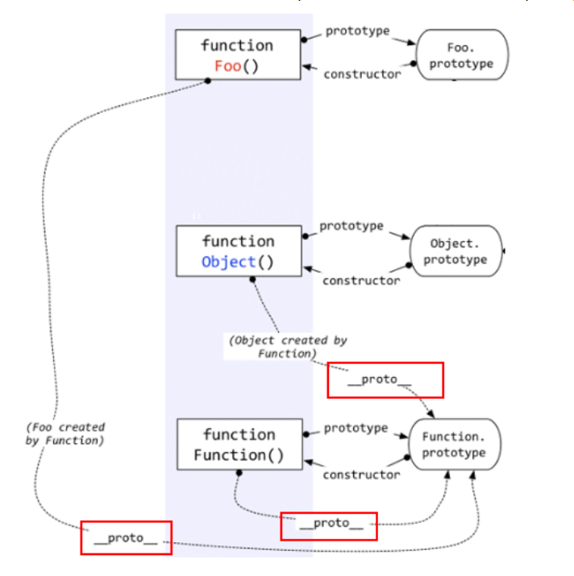

##### 原型和原型链    

1. 所有的引用类型（数组、对象、函数），都具有对象特性，即可自由扩展属性（null除外）

2. 所有的引用类型（数组、对象、函数），都有一个__proto__属性（隐式原型），属性值是一个普通的对象

3. 所有的函数，都有一个prototype属性，属性值也是一个普通的对象

4. 所有的引用类型（数组、对象、函数），__proto__属性值指向它的构造函数的prototype属性值。即：fn.__proto__ === Fn.prototype 

5. Function也是一个函数，函数是一种对象，也有__proto__属性。既然是函数，那么它一定是被Function创建。所以——Function是被自身创建的。所以它的__proto__指向了自身的Prototype。 

   